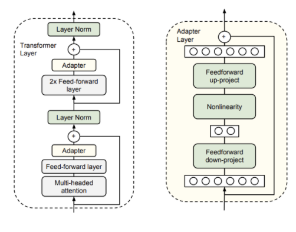

# Adapticons

- Adapting Transformers for all the things


# Requirements
1. Poetry `pip install poetry`
2. Get started with
`make init_project`

# Overview

This project worked to build on top of [Don't stop pretraining](https://github.com/allenai/dont-stop-pretraining). This project analyzed whether we could match performance of the don't stop pretraining code while introducing [Adapters](https://github.com/Adapter-Hub/adapter-transformers) to the RoBERTa architecture.


*Adapter Architecture*



# Process & Performance

The process that we experimented with is called task adaptive pretraining or TAPT. As outlined from the don't stop pretraining paper, the authors:
  - (1) train the RoBERTa base model using on a masked-language-modeling task (MLM) for 100 epochs
  - (2) Use this model from the MLM step on a downstream classification task for 10 epochs

We experimentsed using adapters to follow this process and generally found that the adapters, after hyperparameter tuning, performed as well, or better, than the don't stop pretraining results even when we skipped the MLM step. The main takeaway for us was that we could match results in a less computationally expensive way leveraging Adapters.

# Replication

Our team ran these experiments on Google Colab. However, you can replicate by running the notebooks.
- `colab_train_gpu.ipynb`

In addition, the notebooks `NS_DL_Project_X.ipynb` show different experiments used for this repo.

# Results

- Replicating the Don't stop pretraining paper results


| Dataset       | Original results |          |       Ours       |          |
| ------------- | :--------------: | :------: | :--------------: | :------: |
|               | Baseline Roberta |   TAPT   | Baseline Roberta |   TAPT   |
| CHEMPROT      |       81.9       | 82.6(↗)  |      82.13       | 82.59(↗) |
| RCT           |       87.2       | 87.7(↗)  |      85.59       | 87.64(↗) |
| ACL-ARC       |       63.0       | 67.4(↗)  |      64.28       | 68.69(↗) |
| SCIERC        |       77.3       | 79.3(↗)  |      78.49       | 80.73(↗) |
| HYPERPARTISAN |       86.6       | 90.4(↗)  |       93.5       | 91.81(↘) |
| AGNEWS        |       93.9       | 94.5(↗)  |      93.75       | 94.13(↗) |
| HELPFULNESS   |       65.1       | 68.5(↗)  |      68.42       | 68.61(↗) |
| IMDB          |       95.0       | 95.5(↗)  |      95.42       | 95.03(↘) |
| Average F1    |      81.25       | 83.24(↗) |       82.7       | 83.65(↗) |

- Training using Adapters
- All Macro F1 expect from CHEMPROT and RCT

| Dataset       | TAPT paper results (F1) | Adapter  (F1)- default params (LR 2e-5, 10 epochs) | Adapter (F1) w/ updated params (LR 1e-4, 10 epochs) | Adapter no pretraining (F1) w/ updated params |
| ------------- | ----------------------- | -------------------------------------------------- | --------------------------------------------------- | --------------------------------------------- |
| CHEMPROT      | 82.60%                  | 74.26%                                             | 82.68%                                              | **82.79%**                                    |
| RCT           | **87.70%**              | 87.54%                                             | 87.25%                                              | 87.32%                                        |
| ACL-ARC       | **67.40%**              | 24.22%                                             | 54.04%                                              | 53.97%                                        |
| SCIERC        | **79.30%**              | 44.24%                                             | 76.85%                                              | 76.79%                                        |
| HYPERPARTISAN | **90.40%**              | 36.89%                                             | 71.86%                                              | 75.95%                                        |
| AGNEWS        | **94.50%**              | 93.75%                                             | **94.23%**                                          | **94.2%**                                     |
| HELPFULNESS   | 68.50%                  | 67.93%                                             | 69.47%                                              | **69.51%**                                    |
| IMDB          | **95.50%**              | 95.46%                                             | 95.36%                                              | **95.52%**                                    |

# Data


| Domain           | Task          | Label Type                  | Number of instances (Train/Dev/Test) |
| ---------------- | ------------- | --------------------------- | ------------------------------------ |
| Biomedical       | ChemProt      | Relationship classification | 4169/2427/3469                       |
| Biomedical       | RCT           | Abstract sentence roles     | 18040/30212/30135                    |
| Computer Science | ACL-ARC       | Citation intent             | 1688/114/139                         |
| Computer Science | SciERC        | Relation classification     | 3219/455/974                         |
| News             | Hyperpartisan | Partisanship                | 515/65/65                            |
| News             | Agnews        | Topic                       | 115000/5000/7600                     |
| Reviews          | Helpfulness   | Review helpfulness          | 115251/5000/25000                    |
| Reviews          | IMDB          | Review sentiment            | 20000/5000/25000                     |

# Spreadsheet of all results

[Spreadsheet](https://docs.google.com/spreadsheets/d/1NvbIKsmWVI_wYF_j-fXwX3lfA5Tc2oikwBKMGfuS0mE/edit#gid=0)

# Run language modeling with Adapter

```bash
python -m scripts.run_language_modeling --train_data_file datasets/chemprot/train.txt \
                                        --line_by_line \
                                        --eval_data_file=datasets/chemprot/test.txt \
                                        --output_dir roberta-tapt-chemprot-adapter \
                                        --model_type roberta-base \
                                        --tokenizer_name roberta-base \
                                        --mlm \
                                        --per_gpu_train_batch_size 8 \
                                        --gradient_accumulation_steps 16  \
                                        --model_name_or_path roberta-base \
                                        --do_eval \
                                        --evaluate_during_training  \
                                        --do_train \
                                        --num_train_epochs 100  \
                                        --learning_rate 0.0001 \
                                        --logging_steps 50 \
                                        --overwrite_output_dir \
                                        --adapter_name="chemprot_custom_adapter"
```

## Run evaluation (fine-tuning on target task) w/wo Adapter
Experiments were done with the environmental setting in [adapter-hub](https://github.com/Adapter-Hub/adapter-transformers)
(Python 3.6+ and PyTorch 1.1.0+)

What I did for setting environment is as follows. First create a new conda env and install pytorch. and then,
```
git clone https://github.com/adapter-hub/adapter-transformers.git
cd adapter-transformers
pip install .
pip install sklearn
```

#### Baseline(Roberta) / TAPT evaluation
Below command assumes the name of folder that contains dataset (each split ends with .jsonl) is one of [chemprot, rct-20k, rct-sample, citation_intent(ACL_ARC), sciie(SCIERC), ag(AGNEWS), hyperpartisan_news(HYPERPARTISAN), imdb, amazon(helpfulness)].

Download link for dataset is [here](https://github.com/allenai/dont-stop-pretraining/blob/master/environments/datasets.py). Append train.jsonl, dev.jsonl, test.jsonl after each url.
```bash
python modeling.new_train.py \
  --do_train \
  --do_eval \
  --data_dir datasets/chemprot/ \
  --max_seq_length 512 \
  --per_device_train_batch_size 16 \
  --gradient_accumulation_steps 1 \
  --learning_rate 2e-5 \
  --num_train_epochs 10 \
  --output_dir results/baseline/chemprot/ \
  --task_name chemprot \
  --do_predict \
  --load_best_model_at_end \
  --model_name_or_path roberta-base \
  --metric macro \
```
For evaluating TAPT model, intput the path of saved TAPT model(e.g., cks/tapt-acl/) in --model_name_or_path.

#### Roberta with a single adapter evaluation
```bash
python modeling.new_train.py \
  --do_train \
  --do_eval \
  --data_dir datasets/hyperpartisan_news/ \
  --max_seq_length 512 \
  --per_device_train_batch_size 16 \
  --gradient_accumulation_steps 1 \
  --learning_rate 2e-5 \
  --num_train_epochs 10 \
  --output_dir results/adapter/hyperpartisan_news/ \
  --task_name HYPER \
  --do_predict \
  --load_best_model_at_end \
  --train_adapter \
  --model_name_or_path cks/roberta-tapt-hyper-adapter/ \
  --adapter_config pfeiffer \
  --metric macro \
```

For argument --task_name, new_train.py expect this the same as the task name of adapter which was used when you performed pra-training. Specifically, when you pre-trained adapter, you add_adapter with a particular name such as "sst-2" as below.

model.add_adapter("sst-2", AdapterType.text_task)

If those are different, the script will print the message like "no prediction head for...". However, the training process is not affected by this message.

For training adapter which is not pre-trained on language corpus, replace --train_adapter with --train_adapter_wop and set --model_name_or_path as roberta-base.

#### Roberta with adapter fusion model evaluation
```bash
python modeling.new_train.py \
  --do_train \
  --do_eval \
  --data_dir datasets/hyperpartisan_news/ \
  --max_seq_length 512 \
  --per_device_train_batch_size 16 \
  --gradient_accumulation_steps 1 \
  --learning_rate 2e-5 \
  --num_train_epochs 10 \
  --output_dir results/adapter_fusion/hyper_rct/ \
  --task_name hyper_cls \
  --do_predict \
  --load_best_model_at_end \
  --train_fusion \
  --model_name_or_path roberta-base \
  --adapter_config pfeiffer \
  --metric macro \
  --fusion_adapter_path1 results/adapter/hyperpartisan_news2/ \
  --fusion_adapter_path2 results/adapter/rct-sample/ \
```
What the above command does is creating roberta-base model, loading a series of individual adapter sequentially, making a fusion layer, and performing fine-tuning the weights in the fusion layers and the final classification layers while others are fixed.

You can feed saved adapter modules (either pre-trained or fine-tuned on a specific target task) up to 8 by input the path of each saved adapter module to --fusion_adapter_path1, --fusion_adapter_path2, etc.

For loading fine-tuned adapter module, the path should be like adapter/hyperpartisan_news2/ rather than adapter/hyperpartisan_news2/adapter_folder/. Copy and paste files in adapter_folder to the upper directory (adapter/hyperpartisan_news2/) before executing the command.

For more information about arguments,
https://github.com/Adapter-Hub/adapter-transformers/blob/master/src/transformers/adapter_training.py

https://github.com/Adapter-Hub/adapter-transformers/blob/master/src/transformers/training_args.py
